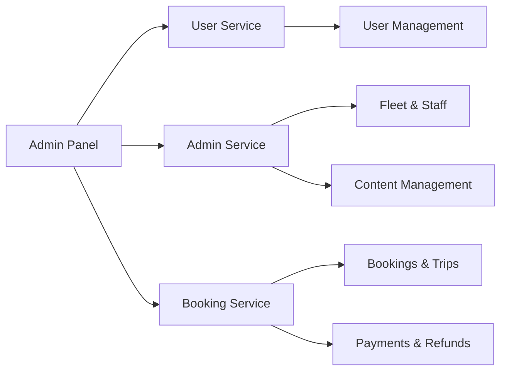

# LimosPro Admin Panel Documentation

## 📋 Table of Contents

1. [Overview](#overview)
2. [Tech Stack](#tech-stack)
3. [Getting Started](#getting-started)
4. [Architecture](#architecture)
5. [Feature Modules](#feature-modules)
6. [Authentication & Permissions](#authentication--permissions)
7. [API Integration](#api-integration)
8. [UI Components](#ui-components)
9. [Development Workflow](#development-workflow)
10. [Deployment](#deployment)
11. [Troubleshooting](#troubleshooting)

---

## 📖 Overview

**LimosPro Admin Panel** is a comprehensive web-based administration platform for managing limousine services. It provides a centralized interface for managing bookings, fleet operations, chauffeurs, payments, content management, and more.

### Key Features
- 🚗 **Fleet Management** - Manage vehicles, chauffeurs, and crew members
- 📅 **Booking System** - View and manage customer bookings and trips
- 💰 **Payment Processing** - Handle payments, refunds, and financial transactions
- 👥 **User Management** - Manage users, roles, and permissions
- 🌍 **Regional Operations** - Multi-region support with regional admins
- 📊 **Analytics Dashboard** - Real-time metrics and reporting
- 🎨 **Content Management** - Manage website content, blogs, FAQs, and SEO
- 🔒 **Dynamic Permissions** - Flexible role-based and permission-based access control

---

## 🛠 Tech Stack

### Core Framework
- **React 19.1.0** - Frontend library
- **TypeScript 5.8.3** - Type-safe development
- **Vite 7.0.4** - Build tool and dev server

### UI & Styling
- **TailwindCSS 4.1.11** - Utility-first CSS framework
- **Radix UI** - Accessible UI components
- **Framer Motion 12.23.24** - Animation library
- **Lucide React** - Icon library

### State Management & Data Fetching
- **Zustand 5.0.6** - Lightweight state management
- **TanStack Query 5.83.0** - Server state management
- **React Hook Form 7.60.0** - Form management
- **Zod 4.0.5** - Schema validation

### Routing & Navigation
- **React Router DOM 7.7.0** - Client-side routing

### Data Visualization
- **Chart.js 4.5.1** - Charts and graphs
- **React ChartJS 2** - React wrapper for Chart.js
- **Recharts 2.15.4** - Declarative charts
- **React Simple Maps** - Map visualizations

### Maps & Location
- **React Leaflet 5.0.0** - Interactive maps
- **Leaflet Routing Machine** - Route planning
- **@react-google-maps/api** - Google Maps integration

### Development Tools
- **Biome 2.3.4** - Fast linter and formatter
- **ESLint** - Code quality
- **Husky** - Git hooks
- **Commitlint** - Commit message linting

---

## 🚀 Getting Started

### Prerequisites
- **Node.js** >= 22.17.0
- **npm** >= 10.9.2
- **Bun** >= 1.3.x (recommended for faster package management)

### Installation

1. **Clone the repository**
   ```bash
   git clone <repository-url>
   cd limos-pro-frontend
   ```

2. **Install dependencies**
   ```bash
   # Using npm
   npm install
   
   # Using bun (recommended - faster)
   bun install
   ```

   **Note:** Ensure you have Bun version >= 1.3.x installed (`bun -v`).

3. **Configure environment variables**
   
   Create a `.env` file in the root directory:
   ```bash
   cp .env.example .env
   ```

   Update the following variables:
   ```env
   VITE_GOOGLE_MAP_KEY=your_google_maps_api_key
   VITE_API_USER_SERVICE_URL=https://your-user-service-url
   VITE_API_ADMIN_SERVICE_URL=https://your-admin-service-url
   VITE_API_BOOKING_SERVICE_URL=https://your-booking-service-url
   ```

4. **Start the development server**
   ```bash
   # Using npm
   npm run dev
   
   # Using bun (recommended)
   bun run dev
   ```

   The application will be available at `http://localhost:5173`

### Available Scripts

| npm Command | bun Command | Description |
|-------------|-------------|-------------|
| `npm run dev` | `bun run dev` | Start development server |
| `npm run build` | `bun run build` | Build for production |
| `npm run preview` | `bun run preview` | Preview production build |
| `npm run lint` | `bun run lint` | Run Biome linter |
| `npm run lint:fix` | `bun run lint:fix` | Fix linting issues |
| `npm run format` | `bun run format` | Format code with Biome |
| `npm run check` | `bun run check` | Check code with Biome |
| `npm run check:fix` | `bun run check:fix` | Check and fix code issues |

---

## 🏗 Architecture

### Microservices Architecture

The admin panel communicates with three core microservices:



### Project Structure

```
limos-pro-frontend/
├── src/
│   ├── api/                    # API integration layer
│   │   ├── login.api.ts
│   │   ├── chauffeur.api.ts
│   │   ├── booking.api.ts
│   │   └── ...41 API files
│   ├── components/             # Reusable components
│   │   ├── ui/                # Base UI components (46 components)
│   │   ├── layouts/           # Layout components (Sidebar, Header)
│   │   ├── dashboard/         # Dashboard-specific components
│   │   ├── fleet/             # Fleet management components
│   │   └── ...28+ feature-specific folders
│   ├── pages/                  # Page components
│   │   ├── auth/              # Authentication pages
│   │   ├── dashboard/         # Dashboard pages
│   │   ├── users/             # User management pages
│   │   └── ...28+ feature modules
│   ├── routes/                 # Routing configuration
│   │   ├── config.tsx         # Route definitions
│   │   └── renderRoutes.tsx   # Route renderer
│   ├── hooks/                  # Custom React hooks
│   ├── lib/                    # Utility libraries
│   │   └── constant.ts        # Application constants
│   ├── utils/                  # Utility functions
│   │   ├── Helper.ts          # Helper functions
│   │   ├── roles.ts           # Role & permission mapping
│   │   └── ProtectedRoute.tsx # Route protection
│   └── App.tsx                 # Root component
├── public/                     # Static assets
├── .env                        # Environment variables
├── package.json               # Dependencies
├── vite.config.ts             # Vite configuration
└── tsconfig.json              # TypeScript configuration
```

### Key Architectural Patterns

#### 1. Lazy Loading
All routes use lazy loading for optimal performance:
```typescript
const DashboardPage = lazy(() => import("../pages/dashboard/Dashboard"));
```

#### 2. Protected Routes
Routes are protected based on user roles and permissions:
```typescript
{
  layout: "protected",
  module: "users",
  routes: [
    { path: ROUTING_URLS.USERS, element: UsersPage }
  ]
}
```

#### 3. API Layer Separation
Each feature has dedicated API files for clean separation:
- `chauffeur.api.ts`
- `booking.api.ts`
- `payment.api.ts`

#### 4. State Management
- **TanStack Query** - Server state, caching, and synchronization
- **Zustand** - Client state (UI preferences, user session)
- **React Hook Form** - Form state

---

## 🎯 Feature Modules

### 1. **Dashboard** 📊
- Real-time metrics and KPIs
- Charts and analytics
- Quick access to key features

**Routes:**
- `/dashboard` - Main dashboard

---

### 2. **User Management** 👥
Manage system users with role-based access control.

**Features:**
- Create, edit, view, and delete users
- Role assignment
- Permission management

**Routes:**
- `/users` - User listing
- `/users/create` - Create user
- `/users/edit/:id` - Edit user
- `/users/:id` - View user details

---

### 3. **Fleet Management** 🚗
Manage vehicles, maintenance, and availability.

**Features:**
- Vehicle CRUD operations
- Fleet tracking
- Availability management
- Vehicle details and specifications

**Routes:**
- `/fleets` - Fleet listing
- `/fleets/create` - Add vehicle
- `/fleets/edit/:id` - Edit vehicle
- `/fleets/:id` - View vehicle details

---

### 4. **Chauffeur Management** 🎩
Manage chauffeurs, their schedules, and performance.

**Features:**
- Chauffeur profiles
- Schedule management
- Performance tracking
- Document management

**Routes:**
- `/chauffeur` - Chauffeur listing
- `/chauffeur/create` - Add chauffeur
- `/chauffeur/edit/:id` - Edit chauffeur
- `/chauffeur/:id` - View chauffeur details

---

### 5. **Booking System** 📅
View and manage customer bookings.

**Features:**
- Booking overview
- Status management
- Booking details
- Customer information

**Routes:**
- `/bookings` - Booking listing
- `/bookings/:id` - View booking details

---

### 6. **Trip Management** 🗺️
Track and manage active and completed trips.

**Features:**
- Trip tracking
- Live map view
- Trip history
- Route details

**Routes:**
- `/trips` - Trip listing
- `/trips/:id` - View trip details
- `/trips/map/:id` - Live trip tracking

---

### 7. **Payment & Refunds** 💳
Handle financial transactions.

**Features:**
- Payment processing
- Transaction history
- Refund management
- Payment analytics

**Routes:**
- `/payments` - Payment listing
- `/payments/:id` - Payment details
- `/refund` - Refund listing
- `/refund/:id` - Refund details
- `/refund-requests` - Pending refund requests

---

### 8. **Regional Management** 🌍
Manage multi-region operations.

**Features:**
- Region configuration
- Regional admin assignment
- Region-specific settings

**Routes:**
- `/region` - Region listing
- `/region/create` - Create region
- `/region/edit/:id` - Edit region
- `/region-admin` - Regional admin management

---

### 9. **Affiliate Management** 🤝
Manage affiliate partners and commissions.

**Features:**
- Affiliate registration
- Commission tracking
- Performance metrics

**Routes:**
- `/affiliate` - Affiliate listing
- `/affiliate/create` - Add affiliate
- `/affiliate/edit/:id` - Edit affiliate
- `/affiliate/:id` - View affiliate details

---

### 10. **Crew & Staff Management** 👨‍💼
Manage crew members and staff.

**Features:**
- Crew member profiles
- Staff management
- Role assignments
- Schedule management

**Routes:**
- `/crew-members` - Crew listing
- `/crew-members/create` - Add crew member
- `/crew-members/edit/:id` - Edit crew member
- `/staff-members` - Staff listing
- `/staff-members/create` - Add staff member
- `/staff-members/edit/:id` - Edit staff member

---

### 11. **Content Management** 📝
Manage website content and pages.

**Features:**
- Page content editing
- SEO optimization
- Meta tags management
- Content blocks

**Routes:**
- `/content_management/pages` - Page listing
- `/content_management/pages/create` - Create page
- `/content_management/pages/edit/:id` - Edit page
- `/seo` - SEO dashboard

---

### 12. **Blog Management** ✍️
Create and manage blog posts.

**Features:**
- Blog post creation
- Rich text editor
- Featured images
- SEO optimization

**Routes:**
- `/blog-posts` - Blog listing
- `/blog-posts/create` - Create blog post
- `/blog-posts/edit/:id` - Edit blog post
- `/blog-posts/:id` - View blog post

---

### 13. **News Management** 📰
Publish and manage news articles.

**Routes:**
- `/news` - News listing
- `/news/create` - Create news
- `/news/edit/:id` - Edit news

---

### 14. **FAQ Management** ❓
Manage frequently asked questions.

**Routes:**
- `/faq` - FAQ listing
- `/faq/create` - Add FAQ
- `/faq/edit/:id` - Edit FAQ

---

### 15. **Testimonials** ⭐
Manage customer testimonials.

**Routes:**
- `/testimonials` - Testimonial listing
- `/testimonials/create` - Add testimonial
- `/testimonials/edit/:id` - Edit testimonial

---

### 16. **Partner Management** 🤝
Manage business partners.

**Routes:**
- `/our-partners` - Partner listing
- `/our-partners/create` - Add partner
- `/our-partners/edit/:id` - Edit partner

---

### 17. **Contact Requests** 📧
View and respond to customer inquiries.

**Routes:**
- `/contact-requests` - Contact request listing

---

### 18. **IP Whitelist** 🔒
Manage IP access control.

**Routes:**
- `/ip-whitelist` - IP whitelist management
- `/ip-whitelist/create` - Add IP
- `/ip-whitelist/edit/:id` - Edit IP

---

### 19. **Reports** 📈
Generate and view reports.

**Routes:**
- `/reports` - Reports dashboard

---

### 20. **Settings** ⚙️
Application configuration and settings.

**Routes:**
- `/settings` - Settings page

---

## 🔐 Authentication & Permissions

### Authentication Flow

1. **Login** - User enters credentials at `/admin/login`
2. **Token Generation** - Backend returns `accessToken` and `refreshToken`
3. **Storage** - Tokens stored in `localStorage`
4. **Protected Routes** - Routes verify token before access

### Dynamic Permission System

The admin panel uses a **dynamic permission-based access control** system. See [DYNAMIC_PERMISSIONS_GUIDE.md](./DYNAMIC_PERMISSIONS_GUIDE.md) for detailed information.

#### Key Concepts

**Permissions from Backend:**
```json
{
  "roles": "Super Admin",
  "permissions": [
    "manageUsers",
    "manageRoles",
    "accessAllFeatures"
  ]
}
```

**Permission Mapping:**
```typescript
PERMISSION_TO_ROUTE_MAPPING = {
  'manageUsers': ['/users', '/users/create', '/users/edit/:id'],
  'manageFleet': ['/fleets', '/fleets/create', '/fleets/edit/:id'],
  'accessAllFeatures': [...allRoutes]
}
```

#### Common Roles & Permissions

| Role | Permissions | Access |
|------|-------------|--------|
| **Super Admin** | `accessAllFeatures` | Full system access |
| **Regional Admin** | `manageRegion*`, `viewReports` | Regional operations |
| **SEO Agent** | `optimizeContent`, `manageSeo` | Content & SEO |
| **Affiliate Manager** | `manageAffiliates` | Affiliate operations |
| **Fleet Manager** | `manageFleet`, `manageChauffeurs` | Fleet operations |

### Protected Route Implementation

Routes are automatically protected based on permissions:

```typescript
<ProtectedRoute>
  <UsersPage />
</ProtectedRoute>
```

The `ProtectedRoute` component:
1. Checks if user is authenticated
2. Verifies user has required permissions
3. Redirects to login if unauthorized

---

## 🌐 API Integration

### API Services

The frontend communicates with backend microservices via 41+ API modules:

#### User Service APIs
- `login.api.ts` - Authentication
- `getAlUser.api.ts`, `createUser.api.ts`, `updateUser.api.ts`, `deleteUser.api.ts`
- `role.api.ts`, `permission.api.ts` - Role & permission management

#### Admin Service APIs
- `chauffeur.api.ts` - Chauffeur operations
- `fleet.api.ts` - Fleet operations
- `crewMember.api.ts`, `staffMember.api.ts` - Staff management
- `region.api.ts`, `regionAdmin.api.ts` - Regional operations
- `contentServices.api.ts`, `contentBlock.api.ts` - Content management
- `faq.api.ts`, `news.api.ts`, `testimonial.api.ts` - Content modules
- `ourPartners.api.ts` - Partner management
- `ipWhiteList.api.ts` - Security
- `metaKeyWord.api.ts`, `tag.api.ts` - SEO

#### Booking Service APIs
- `getALBookings.api.ts`, `getBookingById.api.ts` - Booking retrieval
- `getAllTrips.api.ts`, `getTripById.api.ts`, `deleteTrips.api.ts` - Trip management
- `payment.api.ts`, `getAllRefund.api.ts` - Financial operations
- `contactRequest.api.ts` - Customer inquiries

### API Configuration

**Base URLs** (configured in `.env`):
```typescript
const API_ENDPOINTS = {
  userService: import.meta.env.VITE_API_USER_SERVICE_URL,
  adminService: import.meta.env.VITE_API_ADMIN_SERVICE_URL,
  bookingService: import.meta.env.VITE_API_BOOKING_SERVICE_URL
}
```

### Using TanStack Query

Example API call with caching:
```typescript
const { data, isLoading, error } = useQuery({
  queryKey: ['users'],
  queryFn: getAllUsers,
  staleTime: 1000 * 60 * 5 // 5 minutes
});
```

---

## 🎨 UI Components

The admin panel includes **46 custom UI components** built on Radix UI and TailwindCSS.

### Component Categories

#### 1. Form Components
- `button.tsx` - Primary, secondary, outline variants
- `input.tsx`, `textarea.tsx` - Text inputs
- `select.tsx`, `multi-select.tsx` - Selection components
- `checkbox.tsx`, `switch.tsx` - Toggle components
- `calendar.tsx` - Date picker
- `field.tsx` - Form field wrapper with validation

#### 2. File Upload Components
- `image-upload.tsx` - Single image upload
- `multiple-image-upload.tsx` - Multiple images
- `upload-files.tsx` - Generic file upload
- `upload-with-url.tsx` - Upload with URL option
- `upload-inline-file.tsx` - Inline file upload

#### 3. Data Display
- `table.tsx` - Data tables with TanStack Table
- `card.tsx` - Container cards
- `badge.tsx` - Status badges
- `avatar.tsx` - User avatars
- `chart.tsx` - Chart components

#### 4. Navigation
- `sidebar.tsx` - Main navigation sidebar
- `breadcrumb.tsx` - Breadcrumb navigation
- `tabs.tsx` - Tab navigation
- `pagination.tsx` - Page navigation

#### 5. Feedback
- `alert.tsx` - Alert messages
- `toast.tsx`, `sonner.tsx` - Notifications
- `dialog.tsx` - Modal dialogs
- `drawer.tsx` - Side drawer
- `popover.tsx`, `hover-card.tsx` - Popovers
- `tooltip.tsx` - Tooltips

#### 6. Layout
- `accordion.tsx` - Collapsible sections
- `collapsible.tsx` - Collapsible content
- `separator.tsx` - Visual separators
- `sheet.tsx` - Side sheets
- `skeleton.tsx` - Loading skeletons

### Component Usage Example

```tsx
import { Button } from "@/components/ui/button";
import { Card } from "@/components/ui/card";
import { Field } from "@/components/ui/field";

function MyForm() {
  return (
    <Card>
      <Field label="Email" error={errors.email}>
        <Input type="email" {...register('email')} />
      </Field>
      
      <Button variant="primary">Submit</Button>
    </Card>
  );
}
```

---

## 💻 Development Workflow

### Code Quality

#### Linting & Formatting
The project uses **Biome** for fast linting and formatting:

```bash
# Check code quality
npm run check

# Auto-fix issues
npm run check:fix

# Format code
npm run format
```

#### Git Hooks
**Husky** runs quality checks before commits:
- Lints staged files
- Formats code
- Validates commit messages

#### Commit Message Format
Uses **Conventional Commits**:
```
<type>(<scope>): <subject>

feat(auth): add login functionality
fix(booking): resolve date picker issue
docs(readme): update setup instructions
```

### Development Best Practices

1. **Component Organization**
   - Keep components small and focused
   - Use composition over inheritance
   - Extract reusable logic into hooks

2. **Type Safety**
   - Define interfaces for all data structures
   - Use Zod for runtime validation
   - Avoid `any` types

3. **Performance**
   - Use lazy loading for routes
   - Implement proper memoization
   - Optimize re-renders with React.memo

4. **API Calls**
   - Use TanStack Query for server state
   - Implement proper error handling
   - Show loading states

5. **Styling**
   - Use TailwindCSS utility classes
   - Follow design system conventions
   - Keep styles consistent

### Testing Locally

1. **Start development server**
   ```bash
   npm run dev
   ```

2. **Test different roles**
   - Login with different user roles
   - Verify permission-based access
   - Check route protection

3. **Test API integration**
   - Verify CRUD operations
   - Test error handling
   - Check loading states

---

## 🚢 Deployment

### Production Build

1. **Build the application**
   ```bash
   # Using npm
   npm run build
   
   # Using bun (faster)
   bun run build
   ```

   This creates optimized files in the `dist/` folder.

2. **Preview the build**
   ```bash
   # Using npm
   npm run preview
   
   # Using bun
   bun run preview
   ```

### Environment Variables

Ensure all environment variables are set for production:

```env
# Production .env
VITE_GOOGLE_MAP_KEY=prod_google_maps_key
VITE_API_USER_SERVICE_URL=https://prod-user-service.example.com
VITE_API_ADMIN_SERVICE_URL=https://prod-admin-service.example.com
VITE_API_BOOKING_SERVICE_URL=https://prod-booking-service.example.com
```

### Deployment Platforms

#### Vercel (Recommended)
The project includes `vercel.json` configuration:

```bash
# Install Vercel CLI
npm install -g vercel
# or with bun
bun add -g vercel

# Deploy
vercel --prod
```

#### Other Platforms
The `dist/` folder can be deployed to:
- **Netlify**
- **AWS S3 + CloudFront**
- **Azure Static Web Apps**
- **GitHub Pages**

### Build Optimization

The build process includes:
- **Code splitting** - Lazy-loaded routes
- **Tree shaking** - Remove unused code
- **Minification** - Compressed JavaScript/CSS
- **Asset optimization** - Optimized images and fonts

---

## 🛠 Troubleshooting

### Common Issues

#### 1. Environment Configuration Error

**Problem:** Red error screen on startup

**Solution:**
- Verify `.env` file exists
- Check all required variables are set
- Ensure no typos in variable names

```bash
cp .env.example .env
# Edit .env with correct values
```

---

#### 2. API Connection Errors

**Problem:** API calls failing with CORS or network errors

**Solution:**
- Verify backend services are running
- Check API URLs in `.env`
- Verify network connectivity
- Check CORS configuration on backend

---

#### 3. Permission Denied Errors

**Problem:** "Access Denied" when navigating to pages

**Solution:**
- Verify user has correct permissions
- Check `localStorage` for `permissions` key
- Review permission mappings in `utils/roles.ts`
- Re-login to refresh permissions

---

#### 4. Build Failures

**Problem:** `npm run build` fails

npm run build
# or with bun
bun run build
```

---

#### 5. Google Maps Not Loading

**Problem:** Maps show blank or error

**Solution:**
- Verify `VITE_GOOGLE_MAP_KEY` in `.env`
- Check API key restrictions in Google Cloud Console
- Ensure Maps JavaScript API is enabled

---

### Debug Mode

Enable debug logging:
```typescript
// In main.tsx or App.tsx
if (import.meta.env.DEV) {
  console.log('Environment:', import.meta.env);
  console.log('API URLs:', {
    userService: import.meta.env.VITE_API_USER_SERVICE_URL,
    adminService: import.meta.env.VITE_API_ADMIN_SERVICE_URL,
    bookingService: import.meta.env.VITE_API_BOOKING_SERVICE_URL
  });
}
```

---

## 📚 Additional Resources

### Documentation Files
- [DYNAMIC_PERMISSIONS_GUIDE.md](./DYNAMIC_PERMISSIONS_GUIDE.md) - Permission system details
- [LOGIN_TESTING_GUIDE.md](./LOGIN_TESTING_GUIDE.md) - Login testing procedures
- [src/components/pagination/USAGE_GUIDE.md](./src/components/pagination/USAGE_GUIDE.md) - Pagination usage

### Useful Links
- [React Documentation](https://react.dev/)
- [TypeScript Handbook](https://www.typescriptlang.org/docs/)
- [TailwindCSS Docs](https://tailwindcss.com/docs)
- [Radix UI](https://www.radix-ui.com/)
- [TanStack Query](https://tanstack.com/query/latest)
- [React Router](https://reactrouter.com/)

---

## 🤝 Contributing

### Development Setup
1. Fork the repository
2. Create a feature branch
3. Make your changes
4. Run linting and tests
5. Submit a pull request

### Code Standards
- Follow existing code style
- Write meaningful commit messages
- Add comments for complex logic
- Update documentation as needed

---

## 📄 License

[Add license information here]

---

## 👨‍💻 Support

For questions or issues:
- Check existing documentation
- Review troubleshooting section
- Contact development team

---

**Last Updated:** November 2025  
**Version:** 0.0.0
